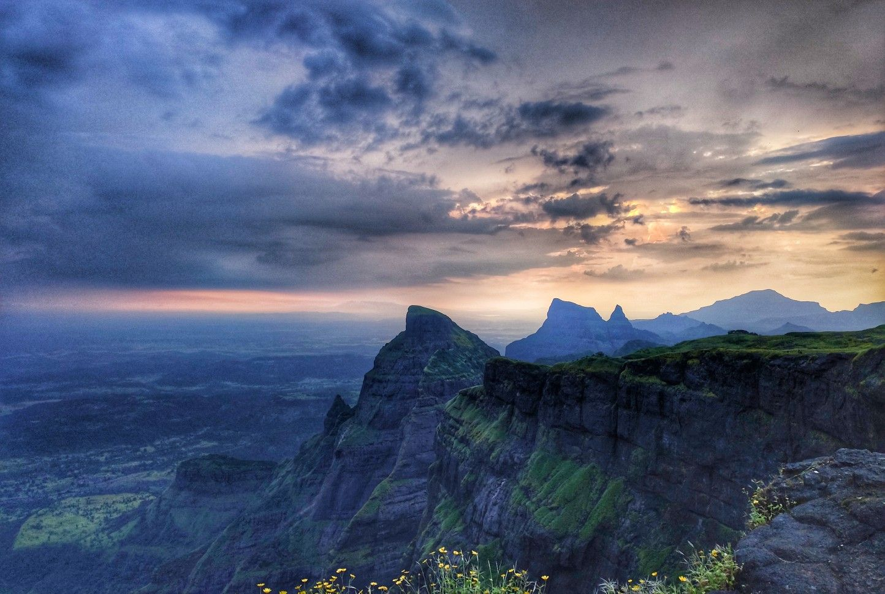

# 🏔️ Trek Maharashtra

A simple and responsive website that showcases the <b>best trekking destinations in Maharashtra</b>.  
Built using <b>HTML, CSS and JavaScript</b>.

---

## 🌐 Live Demo

🔗 https://pranalishinde06.github.io/trek-maharashtra-html-css-js/

---

## 📸 Website Preview

---

## 🏔️ Popular Treks

| Trek | Image |
|-----|------|
| Rajgad |  |
| Lohagad |  |
| Harishchandragad |  |
| Kalsubai |  |
| Torna |  |

---

## 📌 Features

✨ Information about famous trekking places  
📱 Responsive design  
🖼️ Beautiful trekking images  
🧭 Easy navigation  
⚡ Fast static website  

---

## 🛠️ Tech Stack

- HTML5
- CSS3
- JavaScript

---

Open **index.html** in your browser.

---

## 🤝 Contributors

---

## ⭐ Support

If you like this project, give it a ⭐ on GitHub.

---

## 📜 License

This project is open source and free to use.

